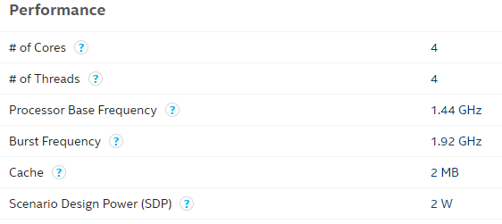
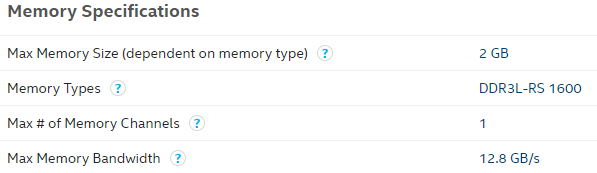
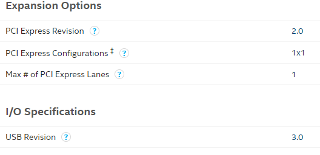
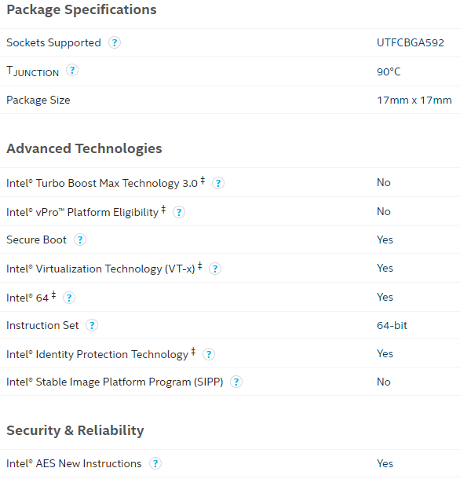

# [Z8350](https://github.com/mcuyun/Z8350) 

#### 归属：[X86架构](https://github.com/mcuyun/X86)

#### [关于悠云](https://github.com/mcuyun)可访问 www.mcuyun.com

## [描述](https://github.com/mcuyun/Z8350/wiki) 

#### 处理能力

#### 内存支持

#### 显示能力

#### 通信能力

#### 封装和其他

---

###  [悠云，为嵌入式](http://www.mcuyun.com)   
###  qitas@qitas.cn

